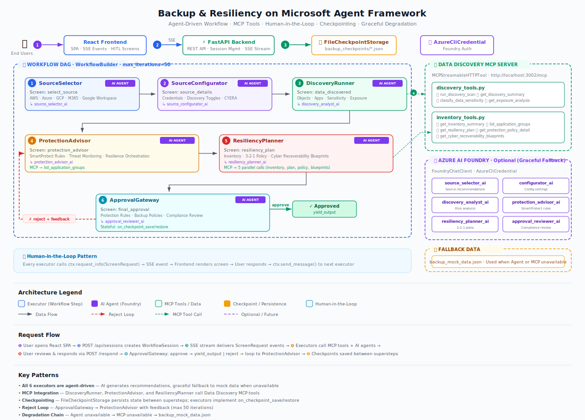

# Backup & Resiliency Workflow

An end-to-end **Azure Backup Policy Configuration** experience built with the [Microsoft Agent Framework](https://pypi.org/project/agent-framework/). It guides administrators through a multi-step wizard to configure backup policies — collecting inputs, validating choices, explaining trade-offs, and producing a deployable backup policy configuration.

## Overview


Configuring backup and resilience plans across multi-cloud environments is complex, tedious, and error-prone. Administrators must understand data classification, retention policies, replication strategies, compliance requirements, and cyber recoverability — all while navigating platform-specific settings. A single misconfiguration can leave critical data unprotected or violate regulatory mandates.

AI agents transform this experience. Instead of manually researching and configuring each setting, agents autonomously discover data, classify sensitivity, recommend protection rules, and generate resiliency plans — turning hours of expert work into a guided conversation. The administrator stays in control through human-in-the-loop checkpoints at every step, while agents handle the heavy lifting:

1. **Select Source** — agents analyze available cloud platforms and SaaS sources, prioritizing which to protect based on data volume and criticality.
2. **Source Details** — agents recommend optimal discovery settings, suggesting which import options to enable for the selected platform.
3. **Data Discovery** — agents autonomously scan and classify data via MCP tools, surfacing sensitivity patterns, exposure risks, and access footprints that would take hours to assess manually.
4. **Protection Advisor** — agents query the application inventory and recommend SmartProtect rules, threat monitoring, and resilience orchestration tailored to the discovered data and compliance posture.
5. **Resiliency Plan** — agents synthesize data from multiple MCP tools to generate a comprehensive 3-2-1 protection policy with cyber recoverability blueprints, eliminating guesswork around backup frequency, retention, and replication.
6. **Final Approval** — agents perform compliance review, flagging gaps and best-practice violations before the administrator signs off — or rejects to iterate.



Each executor emits a `ScreenRequest` via `request_info` to pause for human input. The frontend renders the recommended screen and sends the user's response back.

## Architecture

| Component | Description |
|---|---|
| **Backend** (`backup_api/`) | FastAPI server with SSE streaming for real-time workflow events and human-in-the-loop interactions |
| **Frontend** (`backup-ui/`) | React + Vite UI that renders the guided wizard experience |
| **MCP Server** (`data_discovery_mcp/`) | FastMCP-based Model Context Protocol server providing data discovery, classification, and inventory tools |
| **Workflow** (`backup_api/workflow.py`) | Microsoft Agent Framework workflow definition with executors and agents |

## Prerequisites

- Python 3.12+
- Node.js (for the frontend)
- A [Microsoft Foundry](https://ai.azure.com/) project with a model deployment (e.g. `gpt-5.4` or `gpt-5.4-mini`) — the same model endpoint is used by all agents in the workflow
- Azure CLI logged in (`az login`) — used for authenticating to Foundry via `AzureCliCredential`

## Getting Started

### 1. Create and activate a virtual environment

```powershell
python -m venv .venv
.venv\Scripts\Activate.ps1
```

### 2. Configure environment variables

Copy and edit the environment file at `backup_api/.env`:

```env
# Data Discovery MCP Server (default works for local development)
DATA_DISCOVERY_MCP_ENDPOINT=http://localhost:3002/mcp

# Microsoft Foundry — required for AI-powered agent steps
FOUNDRY_PROJECT_ENDPOINT=https://<your-foundry-resource>.services.ai.azure.com/api/projects/<project-name>
FOUNDRY_MODEL=gpt-5.4
```

| Variable | Description |
|---|---|
| `DATA_DISCOVERY_MCP_ENDPOINT` | URL of the Data Discovery MCP server. Defaults to `http://localhost:3002/mcp` (started automatically by `run.ps1`) |
| `FOUNDRY_PROJECT_ENDPOINT` | Your Foundry project endpoint. Find it in the [Azure AI Foundry portal](https://ai.azure.com/) under your project's **Overview** page |
| `FOUNDRY_MODEL` | The deployed model name in your Foundry project (e.g. `gpt-5.4`, `gpt-5.4-mini`). All agents in the workflow share this model |

Ensure you've run `az login` before starting the workflow — the backend authenticates to Foundry using `AzureCliCredential`.

### 3. Run

The launch script installs all dependencies, starts the MCP server, FastAPI backend, and Vite frontend, and streams their logs:

**Windows (PowerShell):**

```powershell
.\run.ps1
```

**macOS / Linux:**

```bash
chmod +x run.sh
./run.sh
```

This launches:

| Service | URL | Port |
|---|---|---|
| Data Discovery MCP Server | http://localhost:3002 | 3002 |
| FastAPI Backend | http://localhost:8000 | 8000 |
| Vite Frontend | http://localhost:5173 | 5173 |

Open http://localhost:5173 in your browser to start the backup policy wizard.

Press `Ctrl+C` to stop all services.

## Project Structure

```
├── backup_api/              # FastAPI backend + workflow definition
│   ├── app.py               # API endpoints (sessions, SSE, HITL)
│   └── workflow.py           # Workflow graph with executors & agents
├── backup-ui/               # React frontend (Vite)
├── data_discovery_mcp/      # MCP server for data discovery tools
├── backup_checkpoints/      # Persisted workflow checkpoints
├── backup_images/           # Reference UX screenshots (wizard spec)
├── backup_flow_description/ # Step-by-step flow descriptions
├── docs/                    # Documentation and diagrams
├── 03-workflows/            # Agent Framework workflow samples
├── backup_mock_data.json    # Mock data for the workflow
├── requirements.txt         # Python dependencies
├── run.ps1                  # Launch script (Windows)
└── run.sh                   # Launch script (macOS/Linux)
```

## Key Dependencies

- `agent-framework` — Microsoft Agent Framework for workflow orchestration
- `fastapi` / `uvicorn` — Backend API server
- `fastmcp` — MCP server implementation
- `react` / `vite` — Frontend UI
